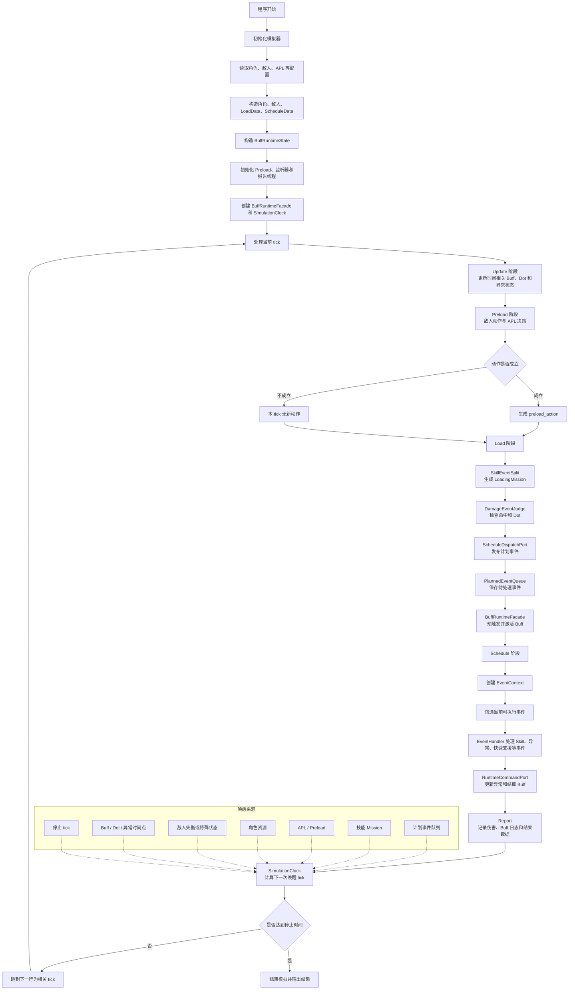

# 新旧 ZSim 改动对比

## 文档介绍

本文用于说明旧版 ZSim 与当前新版 ZSim 的主要差异。

旧版 ZSim 位于 `C:\Users\59275\Desktop\Korlne\zimyuan`，当前新版 ZSim 位于 `C:\Users\59275\Desktop\Korlne\ZSim re`。

旧版工作流程图见 `C:\Users\59275\Desktop\Korlne\zimyuan\docs\流程图.md`。旧版核心流程是固定 tick 循环：`Update -> Preload -> Load -> Schedule -> tick += 1`。

新版在保留整数 tick、APL、Buff 触发、伤害结算、核心数据结构和结果输出的基础上，重点优化了模拟主循环。旧版每个 tick 都会轮询整套模拟流程，新版则通过事件驱动推进，跳到下一次真正需要处理的 tick。

## 主要变化

- 主循环由固定逐帧轮询改为事件驱动推进
- 计划事件由直接写入 `event_list` 改为通过 `ScheduleDispatchPort` 发布
- Buff 加载、激活和清理由 `BuffRuntimeState` 与 `BuffRuntimeFacade` 托管
- Schedule 阶段改为基于 `EventContext` 和事件处理器执行
- 伤害和异常公式拆分到 `zsim/sim_progress/calculation/`
- 角色、敌人、技能、Buff 等核心业务数据结构保持兼容
- 保留常用检测工具，用于检查 Buff、事件调度、主循环和计算模块行为

## 新版工作流程图



## 主循环优化说明

旧版主循环不是每个 tick 都一定会产生伤害，但每个 tick 都会完整执行一轮检查流程：

```text
Update -> Preload -> Load -> BuffLoad -> BuffAdd -> Schedule -> tick += 1
```

也就是说，即使当前 tick 没有命中、没有 Buff 到期、没有 Dot 跳数、没有 APL 行动变化，旧版也会进入这些阶段进行判断。

新版仍然保留整数 tick 作为时间和排序基准，但不再固定 `tick += 1`。当前 tick 处理结束后，`SimulationClock` 会询问各个 `WakeupSource`，找出下一次有行为变化的 tick。

常见的唤醒来源包括：

- 计划事件队列中即将执行的事件
- 技能 Mission 的下一次命中或结束时间
- APL / Preload 可观察到的动作边界
- 角色能量、特殊资源、喧响等资源变化
- 敌人失衡或特殊状态变化
- Buff、Dot、异常状态的时间相关变化
- 模拟停止 tick

因此，新版主要优化可以概括为：

```text
旧版：逐 tick 轮询整套流程
新版：跳到下一个行为相关 tick
```

这种改动不会改变 tick 语义，只改变主循环推进方式。

## 核心流程对比

| 对比项 | 旧版 ZSim | 新版 ZSim |
| --- | --- | --- |
| 主循环 | 每个 tick 固定运行所有阶段，然后 `tick += 1` | 由 `SimulationClock` 计算下一次需要处理的 tick |
| Update 阶段 | `Simulator` 直接调用 Buff 更新时间逻辑 | 通过 `BuffRuntimeFacade.update_time_related_effects(...)` 执行 |
| 计划事件 | 直接向 `event_list` 添加事件 | 通过 `ScheduleDispatchPort` 发布到 `PlannedEventQueue` |
| Schedule 数据 | `ScheduleData.event_list` 是公开 list | `ScheduleData` 内部维护计划事件队列 |
| Buff 加载 | `BuffLoadLoop` 写入 `LOADING_BUFF_DICT` | `BuffRuntimeFacade.load_pending_buffs(...)` 统一处理 |
| Buff 激活 | `buff_add` 提升到 `DYNAMIC_BUFF_DICT` | `BuffRuntimeFacade.activate_pending_buffs(...)` 统一处理 |
| Schedule 结算 | Schedule 直接接触旧 Buff 容器 | Schedule 通过 ReadPort 和 CommandPort 访问运行时数据 |
| 事件处理 | 多类事件逻辑集中在 Schedule 中 | 使用事件处理器分派不同事件 |
| 计算模块 | 公式集中在 `Calculator.py` 和 `CalAnomaly.py` | 公式按类型拆分到 `calculation/` 目录 |
| 数据结构 | 角色、敌人、技能、Buff 等核心结构保持原有语义 | 核心业务数据结构保持兼容，主要变化在运行时封装和调度入口 |
| 验证方式 | 以基础模拟器检查为主 | 保留常用脚本检查 Buff、事件、计算和主循环 |

## 新版主要组件

1. **SimulationClock** - 位于 `zsim/sim_progress/SimulationEngine/`，负责推进模拟 tick。
2. **WakeupSource** - 各子系统声明下一次需要运行的时间点。
3. **PlannedEventQueue** - 位于 `zsim/sim_progress/data_struct/planned_queue.py`，统一管理计划事件。
4. **ScheduleDispatchPort** - 位于 `zsim/sim_progress/data_struct/schedule_dispatch.py`，负责发布计划事件。
5. **BuffRuntimeState** - 位于 `zsim/sim_progress/ScheduledEvent/buff_runtime.py`，保存本次模拟中的 Buff 运行时数据。
6. **BuffRuntimeFacade** - 提供 Buff 加载、激活、清理和 Schedule 阶段结算接口。
7. **BuffRuntimeReadPort** - 提供只读 Buff 快照，减少模块直接读取旧容器。
8. **RuntimeCommandPort** - 位于 `zsim/sim_progress/ScheduledEvent/runtime_command.py`，处理同 tick 的异常更新和 Buff 结算命令。
9. **EventHandler** - 位于 `zsim/sim_progress/ScheduledEvent/event_handlers/`，负责处理不同类型的计划事件。
10. **Calculation 模块** - 位于 `zsim/sim_progress/calculation/`，按公式类型组织伤害和异常计算。

## Buff 流程变化

旧版 Buff 流程由主循环直接串联：

```text
BuffLoadLoop -> LOADING_BUFF_DICT -> buff_add -> DYNAMIC_BUFF_DICT
```

新版 Buff 流程由运行时门面统一管理：

```text
BuffRuntimeState -> BuffRuntimeFacade.load_pending_buffs -> BuffRuntimeFacade.activate_pending_buffs
```

这样做的好处是：

- 主循环不再直接操作 Buff 容器
- Schedule 阶段可以通过端口读取和写入运行时数据
- 后续继续重构 BuffXLogic 时，有更明确的迁移边界
- 常用检测脚本可以针对 facade、read port 和 command port 做边界检查

## 计划事件变化

旧版计划事件通常直接写入 `event_list`：

```text
event_list.append(event)
```

新版计划事件统一通过发布接口：

```text
create_schedule_dispatch_port(...).publish_scheduled(event)
```

`LoadDamageEvent.py` 中已经拒绝旧的 `event_list=` 参数。新增计划事件生产者应优先使用 `ScheduleDispatchPort`，不要直接访问底层队列。

## 计算模块变化

旧版 `Calculator.py` 和 `CalAnomaly.py` 同时负责运行时读取、Buff 聚合、公式计算和结果组装。

新版新增 `zsim/sim_progress/calculation/`，主要结构如下：

- `inputs/`：公式输入数据
- `formulas/`：伤害、异常、紊乱等公式
- `multipliers/`：防御、抗性、易伤和特殊乘区
- `results/`：计算结果结构
- `calculator.py`：常规伤害兼容入口
- `anomaly_calculator.py`：异常伤害兼容入口

新版仍保留旧入口的兼容能力，但公式本身正在逐步向只读输入和纯函数方向迁移。

## 数据结构兼容

新版没有改变模拟器的核心业务数据结构。角色、敌人、技能、Buff、APL 和结果数据仍保持原有语义。

主要变化集中在运行时组织方式：

- `event_list` 的直接写入被计划事件发布接口封装
- 旧 Buff 容器仍保留，但由 `BuffRuntimeState` 和 `BuffRuntimeFacade` 统一管理
- Schedule 阶段通过上下文和端口读取运行时数据
- 计算公式逐步迁移到独立模块，但输入输出仍保持兼容

因此，已有角色配置、APL 配置和常规模拟结果格式不需要因为本次流程调整而改变。

## 常用检测工具

- **Buff 验证脚本**：`scripts/run_buff_refactor_validation.py`
- **主循环一致性脚本**：`scripts/run_buff_main_loop_consistency.py`
- **事件驱动基准脚本**：`scripts/run_event_driven_simulation_benchmark.py`
- **基础检查入口**：`uv run pytest`

## 保留兼容内容

新版仍然保留部分旧 Buff 结构，用于保证模拟结果稳定：

- `exist_buff_dict`
- `LOADING_BUFF_DICT`
- `DYNAMIC_BUFF_DICT`
- `Buff0Manager`
- `BuffLoadLoop`
- 旧 `Buff` 模型
- 现有 `BuffXLogic`

这些内容目前仍是兼容边界。新增代码应优先使用 `BuffRuntimeFacade`、`BuffRuntimeReadPort`、`RuntimeCommandPort` 和 `ScheduleDispatchPort`。

## 验证方式

Buff 重构相关验证可以使用：

```bash
uv run python scripts/run_buff_refactor_validation.py
```

检查事件和调度相关改动：

```bash
uv run python scripts/run_buff_refactor_validation.py --typecheck-profile implicit-events
```

检查计算读取相关改动：

```bash
uv run python scripts/run_buff_refactor_validation.py --typecheck-profile calculator-reads
```

运行基础检查：

```bash
uv run pytest
```

## 参考文件

- `C:\Users\59275\Desktop\Korlne\zimyuan\docs\流程图.md`
- `zsim/simulator/simulator_class.py`
- `zsim/simulator/dataclasses.py`
- `zsim/sim_progress/SimulationEngine/clock.py`
- `zsim/sim_progress/data_struct/planned_queue.py`
- `zsim/sim_progress/data_struct/schedule_dispatch.py`
- `zsim/sim_progress/ScheduledEvent/buff_runtime.py`
- `zsim/sim_progress/ScheduledEvent/runtime_command.py`
- `zsim/sim_progress/calculation/`

## 总结

旧版 ZSim 的流程更直观，每个 tick 固定运行所有阶段。新版 ZSim 的主要优化是事件驱动主循环：保留原有 tick 语义，但从逐 tick 轮询变为跳到下一个行为相关 tick。

这让模拟器在保持数据结构和结果格式稳定的同时，更方便继续扩展角色、Buff、异常机制和模拟流程。
